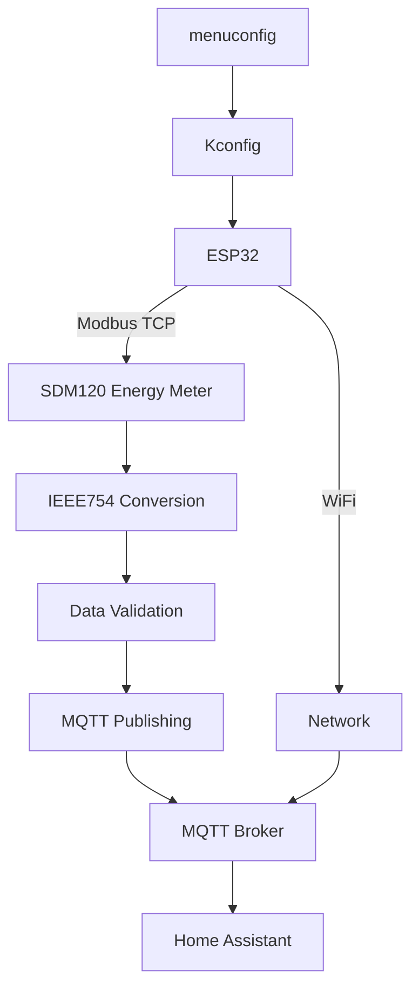

# SDM120 MQTT Monitor - ESP32 Energy Meter Bridge

A **production-ready ESP32 application** that creates a robust **Modbus TCP to MQTT bridge** for Eastron SDM120 energy meters, with full Home Assistant integration and secure configuration management.

Built with **ESP-IDF 5.5** using high-level APIs for maximum reliability and maintainability.

## 🎯 **Project Purpose**

This application reads electrical measurements from an **Eastron SDM120 energy meter** via Modbus TCP and publishes the data to an MQTT broker with automatic Home Assistant discovery. Perfect for home energy monitoring, solar installations, and industrial energy management.

## ✨ **Key Features**

### 🔒 **Security-First Design**
- ✅ **No hardcoded credentials** - all sensitive data via Kconfig
- ✅ WiFi, MQTT, and device settings externalized through `idf.py menuconfig`
- ✅ Environment-specific configurations supported
- ✅ Secure credential management

### 📡 **Robust WiFi Management**
- ✅ **Automatic reconnection** with configurable retry logic
- ✅ **Background monitoring** task for connection health
- ✅ **Progressive retry delays** to avoid network overload
- ✅ **Power management** optimized for Modbus reliability

### 🔧 **Smart Modbus Communication**
- ✅ **High-level ESP-IDF APIs** for reliability (`mbc_master_get_parameter()`)
- ✅ **Enhanced retry logic** specifically tuned for SDM120
- ✅ **IEEE754 conversion fix** for accurate float readings
- ✅ **Connectivity diagnostics** and timeout recovery

### 📊 **Comprehensive Energy Monitoring**
Reads **10 key parameters** from SDM120:
- ⚡ **Voltage** (V)
- 🔌 **Current** (A) 
- 🔥 **Active Power** (W)
- 📊 **Apparent Power** (VA)
- 🔄 **Reactive Power** (VAr)
- 📐 **Power Factor**
- 🎵 **Frequency** (Hz)
- 📈 **Import Energy** (kWh)
- 📤 **Export Energy** (kWh)
- 🏠 **Total Energy** (kWh)

### 🌐 **Advanced MQTT Publishing**
- ✅ **Dual format**: Complete JSON + individual parameter topics
- ✅ **Home Assistant auto-discovery** with proper device classes
- ✅ **Last Will Testament** for availability tracking
- ✅ **Device grouping** - all sensors under single device
- ✅ **Energy Dashboard compatible**

## 🏗️ **Architecture Overview**



### **Core Components**
1. **WiFi Manager**: Robust connection handling with auto-reconnection
2. **Modbus Master**: High-level API communication with SDM120
3. **Data Processor**: IEEE754 conversion and validation
4. **MQTT Publisher**: Dual-format publishing with HA discovery
5. **Configuration System**: Secure, externalized settings

## 🚀 **Quick Setup**

### 1. **Configure Settings**
```bash
cd /path/to/your/project
idf.py menuconfig
```

### 2. **Navigate Configuration Menus**

#### 🏠 **SDM120 Device Configuration**
- **Device IP Address**: `192.168.1.100` (your meter's IP)
- **Device Port**: `502` (Modbus TCP port)
- **Modbus Timeout**: `5000ms` (increase if getting timeouts)
- **Inter-Parameter Delay**: `200ms` (stability delay)

#### 📡 **SDM120 MQTT Configuration**
- **MQTT Broker URI**: `mqtt://192.168.1.10:1883`
- **MQTT Username**: Your MQTT username
- **MQTT Password**: Your MQTT password  
- **MQTT Client ID**: `sdm120_esp32` (unique identifier)
- **MQTT Topic Prefix**: `energy/sdm120`
- **Enable Home Assistant Discovery**: `Yes`

#### 🌐 **WiFi Configuration**
- **WiFi SSID**: Your network name
- **WiFi Password**: Your network password
- **Maximum Retry**: `5` attempts
- **Connection Timeout**: `10000ms`
- **Power Save Mode**: `No Power Save` (recommended)

### 3. **Build and Flash**
```bash
idf.py build flash monitor
```

## 📋 **Project Structure**

```
sdm120-mqtt/
├── main/
│   ├── sdm120-app.c           # Main application (1,302 lines)
│   ├── CMakeLists.txt         # Component dependencies
│   ├── Kconfig.projbuild      # Configuration options
│   └── idf_component.yml      # External components
├── CMakeLists.txt             # Project configuration
├── CONFIG_GUIDE.md            # Detailed setup guide
└── README.md                  # This file
```

## 🔧 **Technical Implementation**

### **Critical IEEE754 Conversion**
SDM120 uses word-swapped IEEE754 format. The application includes a conversion function:

```c
static float convert_sdm120_ieee754(uint32_t raw_u32) {
    // SDM120 uses word-swapped IEEE754 format
    // Swap 16-bit words to get correct float interpretation
    union {
        float f;
        uint32_t u32;
        uint16_t words[2];
    } converter;
    
    converter.u32 = raw_u32;
    uint16_t temp = converter.words[0];
    converter.words[0] = converter.words[1];
    converter.words[1] = temp;
    
    return converter.f;
}
```

### **Enhanced Retry Logic**
```c
// Progressive delay: base_delay + (retry_count * 300ms)
int delay_ms = MODBUS_RETRY_DELAY_BASE_MS + (retry_count * 300);
```

### **WiFi Reconnection Task**
Continuous background monitoring with automatic recovery:
```c
static void wifi_reconnect_task(void* pvParameters) {
    // Monitors connection health every 5 seconds
    // Automatic reconnection with timeout protection
}
```

## 📊 **MQTT Topics Published**

### **Main Data Topic**
- `energy/sdm120/data` - Complete JSON with all measurements + timestamp

### **Individual Parameter Topics**
- `energy/sdm120/voltage` - Line voltage (V)
- `energy/sdm120/current` - Phase current (A)
- `energy/sdm120/active_power` - Active power (W)
- `energy/sdm120/apparent_power` - Apparent power (VA)
- `energy/sdm120/reactive_power` - Reactive power (VAr)
- `energy/sdm120/power_factor` - Power factor
- `energy/sdm120/frequency` - Line frequency (Hz)
- `energy/sdm120/import_energy` - Import energy (kWh)
- `energy/sdm120/export_energy` - Export energy (kWh)
- `energy/sdm120/total_energy` - Total energy (kWh)
- `energy/sdm120/status` - Device availability (`online`/`offline`)

## 🏠 **Home Assistant Integration**

### **Automatic Discovery**
The application publishes MQTT discovery messages for all 10 sensors with:
- ✅ **Proper device classes** (voltage, current, power, energy, etc.)
- ✅ **Correct state classes** (`measurement` vs `total_increasing`)
- ✅ **Appropriate units** (V, A, W, kWh, Hz, VAr, VA)
- ✅ **Custom icons** for each measurement type
- ✅ **Device grouping** under single "SDM120 Energy Meter"
- ✅ **Availability tracking** with Last Will Testament

### **Energy Dashboard Compatible**
- Import/Export energy sensors work with HA Energy Dashboard
- Proper `total_increasing` state class for energy accumulation
- Device information includes manufacturer, model, and version

## 🛠️ **Dependencies**

### **ESP-IDF Components**
- `mqtt` - MQTT client functionality
- `esp_wifi` - WiFi management
- `nvs_flash` - Configuration storage
- `esp_netif` - Network interface
- `esp_event` - Event handling

### **External Components**
- `espressif/mdns: ^1.0.3` - mDNS service discovery
- `espressif/esp-modbus: ^1.0` - Modbus protocol stack
- `mb_example_common` - Modbus example utilities

## ⚡ **Key Strengths**

1. **🔒 Production Ready**: Comprehensive error handling, logging, and recovery mechanisms
2. **🧹 Maintainable**: Clean code structure, well-documented, single responsibility functions  
3. **🎛️ Configurable**: Everything configurable via `idf.py menuconfig` - no code changes needed
4. **🔄 Reliable**: Robust WiFi reconnection, Modbus retry logic, comprehensive timeout handling
5. **🏠 Integration Ready**: Home Assistant auto-discovery, proper MQTT conventions
6. **🔐 Secure**: Externalized credentials, no hardcoded sensitive data

## 🚨 **Security Best Practices**

### ✅ **Implemented Security**
- All credentials externalized through Kconfig
- No sensitive data in source code
- Environment-specific configuration support
- Secure MQTT authentication

### 📝 **Recommended Practices**
```bash
# Add sdkconfig to .gitignore to protect credentials
echo "sdkconfig" >> .gitignore

# Use different passwords for each device
# Use unique MQTT client IDs
# Keep sdkconfig.defaults with safe defaults only
```

## 🔄 **Configuration Management**

### **Change Settings Later**
```bash
idf.py menuconfig          # Modify any settings
idf.py build flash monitor # Apply changes
```

### **Environment-Specific Configs**
```bash
# Development
cp sdkconfig sdkconfig.dev

# Production  
cp sdkconfig sdkconfig.prod

# Switch between environments
cp sdkconfig.prod sdkconfig
idf.py build flash
```

### **Reset to Defaults**
```bash
rm sdkconfig
idf.py menuconfig  # Will use defaults
```

## 📖 **Configuration Reference**

| Setting | Menu | Default | Description |
|---------|------|---------|-------------|
| Device IP | SDM120 Device Configuration | `192.168.1.100` | SDM120 meter IP address |
| MQTT Broker | SDM120 MQTT Configuration | `mqtt://192.168.1.10:1883` | MQTT broker URL |
| MQTT Username | SDM120 MQTT Configuration | (empty) | MQTT authentication username |
| MQTT Password | SDM120 MQTT Configuration | (empty) | MQTT authentication password |
| WiFi SSID | WiFi Configuration | (empty) | WiFi network name |
| WiFi Password | WiFi Configuration | (empty) | WiFi network password |
| Max Retry | WiFi Configuration | `5` | Maximum connection retry attempts |
| Timeout | WiFi Configuration | `10000ms` | Connection establishment timeout |

## 🐛 **Troubleshooting**

### **Common Issues**

**WiFi Connection Problems:**
- Verify SSID and password in menuconfig
- Check WiFi signal strength
- Try increasing connection timeout
- Monitor logs for specific error messages

**Modbus Communication Issues:**
- Verify SDM120 IP address and port
- Check network connectivity to device
- Increase Modbus timeout if getting frequent timeouts
- Verify SDM120 is configured for Modbus TCP

**MQTT Publishing Problems:**
- Verify MQTT broker URI and credentials
- Check network connectivity to broker
- Monitor MQTT broker logs for connection attempts
- Verify topic permissions if using authentication

## 📚 **Additional Documentation**

- **[CONFIG_GUIDE.md](CONFIG_GUIDE.md)** - Detailed configuration guide
- **ESP-IDF Documentation** - https://docs.espressif.com/projects/esp-idf/
- **SDM120 Manual** - Modbus register specifications
- **Home Assistant MQTT Discovery** - Integration documentation

## 🤝 **Contributing**

This project uses professional development practices:
- Clean, documented code following ESP-IDF conventions
- Comprehensive error handling and logging
- Security-first design with externalized configuration
- Production-ready reliability features

## 📄 **License**

This project demonstrates professional ESP32 development practices for industrial IoT applications using ESP-IDF 5.5.

---

**🎉 Ready to monitor your energy consumption with professional-grade reliability!**

Configure with `idf.py menuconfig` and start monitoring your SDM120 energy meter with automatic Home Assistant integration! 🚀 